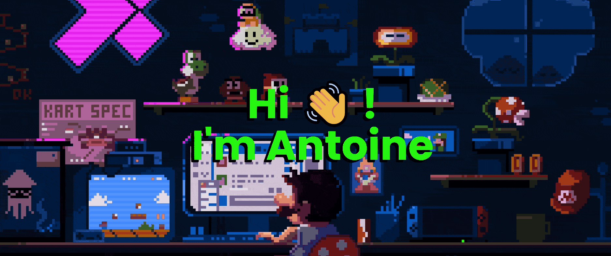

  

---

**Freelance Software Engineer · Go & AWS · Backend / Cloud / React**

I design and ship backend-first, cloud-native products, from APIs and
event-driven systems to web applications and production infrastructure.

[LinkedIn](https://www.linkedin.com/in/antoine-poisson/) · Paris, France 🇫🇷

## What I build

- Backend services and production APIs with Go
- Serverless and event-driven architectures on AWS
- SaaS products and third-party integrations
- React and Next.js applications
- Infrastructure, CI/CD and observability

## Core stack

`Go` · `AWS` · `React` · `Next.js` · `TypeScript` · `Terraform` · `Docker`

  

## Beyond Work

- [Finite Goods](https://github.com/AntoinePoisson/Finite-Goods) : 
  Conflict-safe reservation engine with React + Go/WASM — **[Live demo ↗](https://antoinepoisson.github.io/Finite-Goods/)**

- [Rusted Cube](https://github.com/AntoinePoisson/Rusted-Cube) :
  Rust/WASM voxel engine with raw WebGL2 and greedy meshing — **[Play ↗](https://antoinepoisson.github.io/Rusted-Cube/)**

- [Old School Projects](https://github.com/AntoinePoisson/Old-School-Projects) : 108-project engineering archive, 2018–2023 — **[Explore ↗](https://antoinepoisson.github.io/Old-School-Projects/)**

## Contact

The best way to reach me is through:
[LinkedIn](https://www.linkedin.com/in/antoine-poisson/)

---

  

